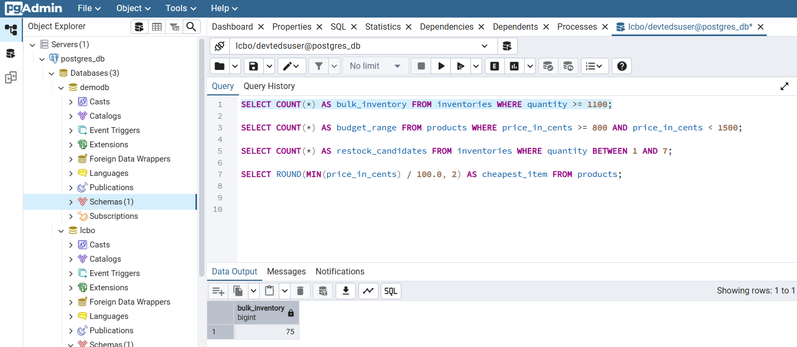

# INFO8985 In-Class Task 2 – LCBO Monitoring with SigNoz

This project enhances the SigNoz observability setup by adding **custom SQL metrics** from a PostgreSQL LCBO dataset and enabling **built-in PostgreSQL receiver metrics** in the OpenTelemetry Collector config.

---
## How to Run:
```bash
ansible-playbook up.yml
```

```bash
ansible-playbook down.yml
```

## What Changed

### 1. `sqlquery` Receiver

We added four custom SQL queries in the `otel-collector-config.yaml` to extract business metrics:

```yaml
sqlquery:
  driver: postgres
  datasource: "host=db port=5432 user=devtedsuser password=devtedspass sslmode=disable database=lcbo"
  queries:
    - sql: "SELECT COUNT(*) AS bulk_inventory FROM inventories WHERE quantity >= 1100"
      metrics:
        - metric_name: "lcbo_bulk_inventory_items"
          value_column: "bulk_inventory"

    - sql: "SELECT COUNT(*) AS budget_range FROM products WHERE price_in_cents >= 800 AND price_in_cents < 1500"
      metrics:
        - metric_name: "lcbo_budget_product_range"
          value_column: "budget_range"

    - sql: "SELECT COUNT(*) AS restock_candidates FROM inventories WHERE quantity BETWEEN 1 AND 7"
      metrics:
        - metric_name: "lcbo_restock_candidate_count"
          value_column: "restock_candidates"

    - sql: "SELECT ROUND(MIN(price_in_cents) / 100.0, 2) AS cheapest_item FROM products"
      metrics:
        - metric_name: "lcbo_cheapest_item_price"
          value_column: "cheapest_item"
```

---

### 2. `postgresql` Receiver 

We also enabled enhanced built-in PostgreSQL monitoring by activating metrics like rollbacks, commits, and locks:

```yaml
postgresql:
  endpoint: db:5432
  transport: tcp
  username: devtedsuser
  password: devtedspass
  collection_interval: 10s
  tls:
    insecure: true
  databases:
    - lcbo
  metrics:
    postgresql.blocks_read:
      enabled: true
    postgresql.commits:
      enabled: true
    postgresql.rollbacks:
      enabled: true
    postgresql.database.count:
      enabled: true
    postgresql.database.locks:
      enabled: true
```

---

## Screenshots

### SigNoz Dashboard – All Metrics Overview  


### Individual Metrics (from Query Explorer)

- **Bulk Inventory Items**  
  

- **Budget Product Range**  
  

- **Restock Candidate Count**  
  

- **Cheapest Item Price**  
  

---

### SQL Query Results from pgAdmin

- **bulk_inventory_items query**  
  

- **budget_product_range query**  
  

- **restock_candidate_count query**  
  

- **cheapest_item_price query**  
  

---

### Config Verification

- **otel-collector-config.yaml (sqlquery block)**  
  

- **Docker Containers Running**  
  

---

## Notes

- All metrics were verified both in SigNoz and via SQL in pgAdmin.
- PostgreSQL receiver confirms deeper system metrics are also being collected.

## Author
- Jithin Jyothi
